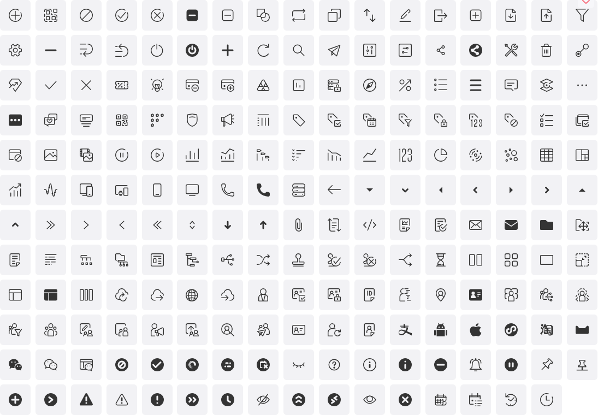

# Icon 图标

在 React Suite 应用中使用图标，我们提供了一些指导和建议。

## React Suite 图标

<a href="/resources/icons" target="_blank" rel="noopener noreferrer" title="React Suite Icons" >
 
</a>

我们提供了一套图标组件，您需要安装`@rsuite/icons`图标组件。

## 安装

<!--{include:<install-guide>}-->

## 获取组件

<!--{include:<import-guide>}-->

## 使用示例

### 大小

<!--{include:`size.md`}-->

### 颜色

<!--{include:`color.md`}-->

### 动态图标

<!--{include:`spin.md`}-->

### 旋转和翻转

<!--{include:`rotate.md`}-->

## 扩展图标

### 自定义 SVG 图标

<!--{include:`custom-svg.md`}-->

### Font awesome 图标

Font awesome 提供了 3 套开源的图标，可以根据需求安装:

```
npm install --save @fortawesome/free-brands-svg-icons
npm install --save @fortawesome/free-regular-svg-icons
npm install --save @fortawesome/free-solid-svg-icons
```

- [Font awesome 图标库](https://fontawesome.com/icons?d=listing&m=free)
- [Font awesome 源代码](https://github.com/FortAwesome/Font-Awesome/tree/master/js-packages/%40fortawesome)

**使用示例**

<!--{include:`custom-font-awesome.md`}-->

### React Icons

react-icons 包含了流行的图标。以下示例将演示如果与 `Icon` 组合使用。

```
npm install react-icons --save
```

- [React Icons](https://react-icons.github.io/react-icons)
- [React Icons Github](https://github.com/react-icons/react-icons)

<!--{include:`custom-react-icons.md`}-->

### Iconfont 图标

如果您是 [iconfont.cn](https://iconfont.cn) 的用户，可以使用 `createIconFont` 方法导入图标资源，在组件中使用。

<!--{include:`create-icon-font.md`}-->

## Props

### `<Icon>`

`<Icon>` 与导入的单个图标都拥有以下属性。

| 属性名称 | 类型 `(默认值)`                | 描述                               |
| -------- | ------------------------------ | ---------------------------------- |
| as       | ElementType&lt;SVGElement&gt;  | 自定义的 svg 图标组件              |
| fill     | string `(currentColor)`        | 图标填充颜色                       |
| flip     | 'horizontal' &#124; 'vertical' | 翻转图标                           |
| pulse    | boolean                        | 动态旋转图标，有脉冲效果           |
| rotate   | number                         | 旋转图标                           |
| spin     | boolean                        | 动态旋转图标                       |
| style    | CSSProperties                  | 图标的样式，例如 fontSize 和 color |

### `createIconFont`

| 属性名称    | 类型 `(默认值)`                  | 描述                                                                                |
| ----------- | -------------------------------- | ----------------------------------------------------------------------------------- |
| commonProps | HTMLAttributes&lt;SVGElement&gt; | 给所有图标组件设置额外公共的属性                                                    |
| scriptUrl   | string &#124; string[]           | [iconfont.cn](https://iconfont.cn) 项目在线生成的 js 地址，当然您也可以使用本地地址 |

### `<IconFont>`

`<IconFont>` 是通过 `createIconFont` 创建的组件。

```js
const IconFont = createIconFont(...);
```

| 属性名称 | 类型 `(默认值)`                | 描述                             |
| -------- | ------------------------------ | -------------------------------- |
| fill     | string `(currentColor)`        | 图标的填充颜色                   |
| flip     | 'horizontal' &#124; 'vertical' | 翻转图标                         |
| icon     | string                         | iconfont 图标集中的名称          |
| pulse    | boolean                        | 动态旋转图标，有脉冲效果         |
| rotate   | number                         | 旋转图标                         |
| spin     | boolean                        | 动态旋转图标                     |
| style    | CSSProperties                  | 图标样式，例如 fontSize 和 color |
